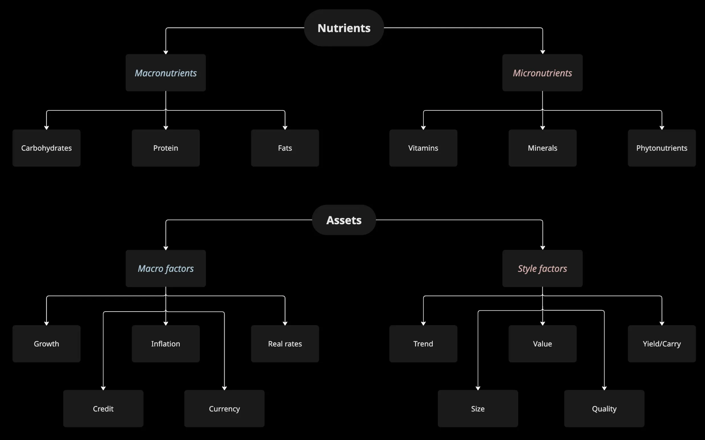
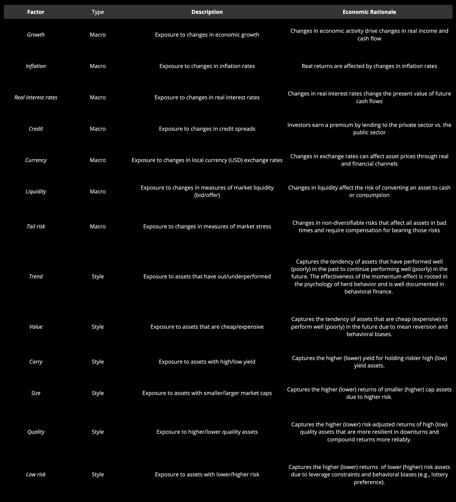
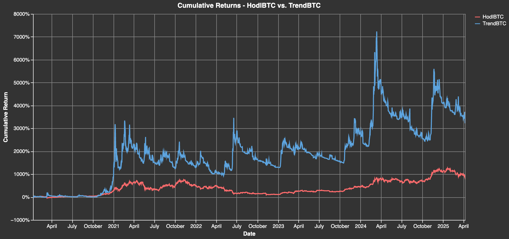
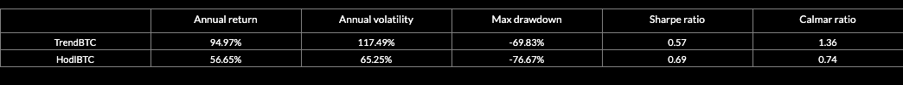

> "Just as eating right requires looking through foods to their underlying nutrients, investing right requires looking through asset class labels to underlying risk exposures. Assets are bundles of factors, and assets earn returns because of their underlying exposures to factor risks." - Andrew Ang

In the wake of the COVID-19 pandemic-driven growth shock and the subsequent inflation and interest rate shocks, it has become clear to most investors that **crypto portfolios are highly exposed to macro risks**. These exposures make most long-only portfolios sensitive to shifts in financial and economic conditions, leaving them vulnerable to significant drawdowns during periods of market turbulence.

**Factor strategies offer alternative return sources that are uncorrelated with traditional long asset exposures, deliver high risk-adjusted returns, and remain resilient to macro shocks and bear markets**.

## Summary {#804897739ca04cc0a96843c7de2afd76}

- **Factor investing is an algorithmic investment approach which systematically captures persistent return sources.**
- **Factors are fundamental drivers of risk and return across and within asset classes. Exposure to these underlying risk factors is generally compensated with positive returns, also known as a risk premium.**
- **A portfolio can be broken down into its underlying risk exposures. These exposures, measured by their sensitivities to various factors, help explain the variation in risk and return within a portfolio. There are three types of factors commonly used to explain the variation in risk and return in a portfolio: 1) macro factors, 2) style factors and 3) statistical factors**.
- **Factor strategies systematically capture exposure to specific, quantifiable asset characteristics through long-short portfolios, known as style factors. Investors are typically rewarded with risk or return premia for bearing these exposures. Style factors allow traditional long-only investors to enhance risk-adjusted returns, diversify across multiple uncorrelated return streams, reduce portfolio risk and improve portfolio resilience to macro shocks**.
- **The factor design process can be broken down into two key steps: factor construction and factor evaluation. Factors can be constructed in two ways: directional strategies (time series) and market-neutral (cross-sectional). For a factor to be considered robust and investable, it generally needs to meet five key criteria: 1) persistence, 2) pervasiveness, 3) robustness, 4) investability and 5) intuitiveness**.

## Factors {#91033181c5cd4d3dafef7e0038f8d62c}

### Factors are to Assets what Nutrients are to Food {#027f7d01986145dcbae89b0271bcad11}

**Factors—also known as common risk factors or sources of systematic risk—are broad and persistent drivers of risk and return across and within asset classes**. These broad economic forces reflect unexpected changes in risks that influence asset prices. Because these risks cannot be diversified away, they are referred to as systematic risks. According to Arbitrage Pricing Theory (APT)—the foundation of modern quantitative finance—**exposure to these underlying risk factors should be compensated with positive returns, known as risk premia** [[1](https://www.sciencedirect.com/science/article/abs/pii/0022053176900466)].

A useful analogy is that “factors are to assets what nutrients are to food.” Just as we consume food for its underlying nutrients rather than the food itself, we invest in assets for the returns they provide in exchange for bearing certain risks. Each food can be broken down into a mix of macronutrients and micronutrients—for example, salmon contains protein and fat (macronutrients) as well as omega-3 fatty acids, vitamin B12, and vitamin D (micronutrients). Likewise, every portfolio is a bundle of risk factor exposures. For instance, a portfolio of U.S. Treasuries (nominal bonds) is primarily exposed to real interest rate risk and inflation risk [[2]](https://www.amazon.com/-/es/Andrew-Ang/dp/0199959323).

## Types of Factors {#6464c24dea504db79fae279993442fb7}

### The Macro and Micro Nutrients of Investing {#be47e6e8546b4948b6a11493fb919da1}

Just as a meal can be broken down into its macro and micronutrients, **any portfolio or investment strategy can be deconstructed into its underlying risk exposures. These exposures, measured by their sensitivities to various factors—also known as factor exposures or betas—help explain the variation in risk and return within a portfolio**.

There are three main types of factors [[3]](https://www.tandfonline.com/doi/abs/10.2469/faj.v51.n3.1904):

- **Macro Factors**: These **capture broad risks across asset classes** and are the key drivers of asset class returns, much like **macronutrients (carbohydrates, proteins, and fats)** provide the primary energy and building blocks for the body. The most common macro factors include **economic growth, inflation, real interest rates, credit, emerging markets and commodities**. Empirical studies suggest that just **three macro factors—economic growth, inflation, and real interest rates—can explain up to 85% of the variance in asset class returns**, while three additional factors—**credit, emerging markets, and commodities—account for another 10%**. These macro factors are often represented by broad, investable market or asset class indexes [[4]](https://www.pm-research.com/content/iijpormgmt/43/5/38).
- **Style Factors (Fundamental Factors)**: These **explain risk and return within asset classes**, much like **micronutrients (vitamins, minerals, and antioxidants)** optimize bodily functions independently of calorie intake. Style factors provide alternative sources of return that are often **uncorrelated with macro conditions**, enhancing portfolio resilience. The most common style factors include **trend/momentum, value, carry/yield, quality, size, and volatility**. Unlike macro factors, style factors primarily **explain cross-sectional differences in returns among assets within the same asset class**.
- **Statistical Factors (Principal Components)**: These are extracted statistically through **principal component analysis (PCA)** and decompose a universe of assets into **uncorrelated drivers of variance (risk)**. Statistical factors are like **hidden nutrients (e.g., polyphenols and gut microbiome benefits)**—they significantly influence portfolio performance, even though they don’t fit neatly into traditional categories. In interest rate markets, for example, the first three principal components typically correspond to **level (PC1), slope (PC2), and curvature (PC3) of the yield curve**, representing the dominant movements in bond yields.

The table below summarizes some of the key characteristics of each type of factor.

## Factor Investing {#4d21aac5e01f4300b090f17280f9c7b2}

### A Balanced and Healthy Diet {#3b347c1345d848b6a3bdc3fdf8b12493}

Factor investing is like maintaining a well-balanced diet for long-term health and vitality. Just as a mix of macronutrients (proteins, fats, and carbohydrates) and micronutrients (vitamins and minerals) work together to optimize bodily function, a well-constructed portfolio benefits from exposure to multiple style factors—trend, carry, value, quality, low volatility, and size—to improve risk-adjusted returns.

**Factor strategies—also called style premia, factor premia, alternative risk premia, alternative beta, exotic beta, or liquid alternatives—systematically capture exposure to specific, quantifiable asset characteristics (nutrients) through long-short portfolios, known as style factors. These factors generate excess returns because they: (1) represent systematic risks that cannot be diversified away, (2) arise from structural investor constraints, or (3) exploit behavioral biases that create persistent inefficiencies. As a result, investors are typically rewarded with risk or return premia for bearing these exposures**.

Factor investing has been around for decades. Its effectiveness is supported by strong historical performance, extensive academic research, and sound economic theory. Institutional investors have used trend-following strategies since the 1980s to generate high risk-adjusted returns. Carry/yield strategies became widely used in the 1990s to exploit large and persistent interest rate differentials between European currencies under the European Exchange Rate Mechanism (ERM). Around the same time, academics were studying value and size factors to explain cross-sectional differences in stock returns [[5]](https://www.bauer.uh.edu/rsusmel/phd/Fama-French_JFE93.pdf).

### Key Benefits of Style Factors {#12f88c6e52d74772b002169af1e03aa6}

- **Return Enhancement**: Just as a well-balanced diet promotes long-term health and longevity, factor strategies enhance a portfolio's risk-adjusted returns by capturing persistent sources of excess return.
- **Portfolio Diversification**: A healthy diet includes a mix of essential macro and micronutrients to maintain energy levels and prevent deficiencies. Similarly, a factor-based approach diversifies across multiple uncorrelated return streams, reducing risk and improving returns across different market cycles.
- **Resilience to Macro Shocks and Market Regimes**: Style factors act as the micronutrients of investing—small but crucial drivers of long-term returns that persist regardless of financial and economic conditions. Just as micronutrients optimize health whether your diet is high-carb, high-fat, or high-protein, style factors generate return premia across different macro environments and market regimes, enhancing portfolio resilience.

## Factor Design {#1cb46a0cd0c38049becff8fe7b008714}

### From Milk to Whey Protein {#1cb46a0cd0c38001a17ae229ac8ed9c9}

Just as whey protein is extracted from milk through a structured process, a factor strategy is constructed from a universe of assets through an algorithmic process. While factor design involves numerous choices and implementation details, the process can be broadly broken down into two key steps: **factor construction** and **factor evaluation**.

### Factor Construction: Financial Feature Engineering {#ec258b41a1c04639a3c6f2ffedb87b63}

Factor construction—akin to **financial feature engineering**—involves **transforming raw data into factor scores** that quantify an asset’s attractiveness. These scores are calculated for each asset and time period in the tradable universe and can **provide predictive information about forward returns**, either with respect to the asset itself (time-series) or relative to other assets in the universe (cross-sectional).

Factors can be derived from various data sources, including:

- **Market data** (e.g., price trends for momentum factors)
- **Fundamental data** (e.g., price-to-earnings ratios for value factors, or on-chain valuation metrics for crypto assets)
- **Alternative data** (e.g., sentiment analysis from social media or news)

Once computed, these factor scores are converted into **signals (forecasts)** that inform portfolio construction, allowing investors to systematically capture return premia associated with factor exposures.

Although many factors are well-known, **implementation details can significantly impact performance**. Factors can be constructed with different lookback windows, rebalancing frequencies, signal transformations (continuous vs. discrete), and weighting schemes. Additionally, they can be applied in two primary ways:

- **Directional strategies (time-series)** – Predicts absolute returns based on historical factor values (e.g. trend-following strategies).
- **Market-neutral strategies (cross-sectional)** – Ranks assets by factor values, then constructs long/short portfolios to capture relative return differences (e.g. carry/yiel strategies).

The choice between directional and market-neutral implementation often depends on asset class characteristics and factor predictability. Some factors, such as carry/yield, tend to perform better in market-neutral implementations, while others, such as trend/momentum, are more effective in directional strategies [[6]](https://papers.ssrn.com/sol3/papers.cfm?abstract_id=2695101). Additionally, implementing factor strategies as long-short portfolios—rather than long-only (smart beta)—can significantly enhance risk-adjusted returns and diversification benefits [[7]](https://papers.ssrn.com/sol3/papers.cfm?abstract_id=3557879).

### Factor Evaluation: Measuring Performance and Robustness {#6e42de54518e4be89beea95ceb8aff50}

Once constructed, factors must be rigorously evaluated using key financial metrics such as:

- **Return-to-risk ratios** (e.g. Sharpe, Sortino, Calmar)
- **Maximum drawdowns and volatility**
- **Correlation with other factors**
- **Portfolio risk and return attribution**

Factor returns are typically defined as the portfolio returns generated by taking asset positions weighted by factor signals. Specifically, they can be computed by multiplying forward returns by factor signals and asset weights.

However, discovering new factors—especially in emerging asset classes like crypto—can be more challenging than widely believed. A growing body of research suggests that many factor discoveries are false positives, prompting the development of more rigorous statistical methods to mitigate data mining biases [[8]](https://www.nber.org/system/files/working_papers/w25481/w25481.pdf)[[9]](https://papers.ssrn.com/sol3/papers.cfm?abstract_id=2528780).

For a factor to be considered robust and investable, it generally needs to meet five key criteria [[10]](https://www.amazon.com/Your-Complete-Guide-Factor-Based-Investing/dp/0692783652):

- **Persistence** – The factor generates excess returns consistently over time.
- **Pervasiveness** – The factor delivers positive returns across multiple asset classes and geographies.
- **Robustness** – The factor's performance holds across different parameter choices and construction methodologies.
- **Investability** – The factor can be implemented at scale and remains profitable after transaction costs.
- **Intuitiveness** – There is a clear economic or behavioral rationale explaining the factor’s return premium.

By following a sound factor design process—rigorous factor construction and implementation, and robust evaluation—investors can extract reliable, systematic returns, just as whey protein is carefully extracted from milk to maximize its nutritional value.

## Factor Assets {#1a523d9ad3654a22ae1a4c9fb43bda4f}

### A New Type of Financial (Dietary) Primitive (Supplement) {#a71cb4d2f4c34c0fa3ca0dd234ec6feb}

Factor Assets are investment products built using directional (time-series) factor signals on individual assets. Unlike traditional assets, which maintain fixed weight exposure (always 100% long), a factor asset employs a directional (time-series) factor signal, dynamically adjusting its exposure between -1 and 1 based on the signal. As a result, it can scale it's exposure up (positive) or down (negative) depending on market conditions. Any factor can be used to compute the signal (trend, carry, value, volatility, etc) as long as it can be implemented in a directional strategy, rather than a cross-sectional one.

By systematically adapting to changing market conditions, factor assets can improve an asset's performance, reduce risk, and deliver smoother, more robust returns over time.

## References {#5644c433479a420187d101d3dc1c8526}

[https://www.sciencedirect.com/science/article/abs/pii/0022053176900466](https://www.sciencedirect.com/science/article/abs/pii/0022053176900466)

[https://www.amazon.com/-/es/Andrew-Ang/dp/0199959323](https://www.amazon.com/-/es/Andrew-Ang/dp/0199959323)

[https://www.tandfonline.com/doi/abs/10.2469/faj.v51.n3.1904](https://www.tandfonline.com/doi/abs/10.2469/faj.v51.n3.1904)

[https://www.pm-research.com/content/iijpormgmt/43/5/38](https://www.pm-research.com/content/iijpormgmt/43/5/38)

[https://www.bauer.uh.edu/rsusmel/phd/Fama-French_JFE93.pdf](https://www.bauer.uh.edu/rsusmel/phd/Fama-French_JFE93.pdf)

[https://papers.ssrn.com/sol3/papers.cfm?abstract_id=2695101](https://papers.ssrn.com/sol3/papers.cfm?abstract_id=2695101)

[https://arxiv.org/pdf/2003.10419](https://arxiv.org/pdf/2003.10419)

[https://www.nber.org/system/files/working_papers/w25481/w25481.pdf](https://www.nber.org/system/files/working_papers/w25481/w25481.pdf)

[https://papers.ssrn.com/sol3/papers.cfm?abstract_id=2528780](https://papers.ssrn.com/sol3/papers.cfm?abstract_id=2528780)

[https://www.amazon.com/Your-Complete-Guide-Factor-Based-Investing/dp/0692783652](https://www.amazon.com/Your-Complete-Guide-Factor-Based-Investing/dp/0692783652)

