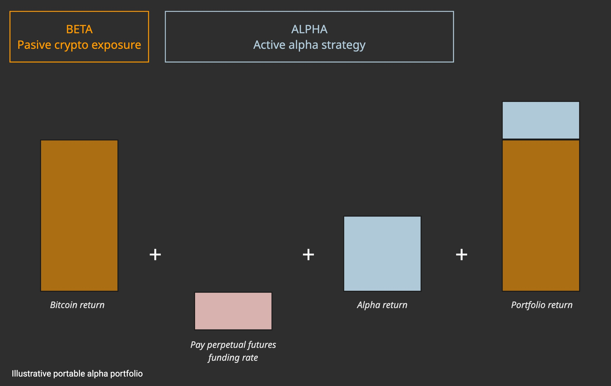

> **“Have you ever bought a hedge fund (actively managed strategy) and been disappointed that the hedge fund did what they said they would do which is beat cash handsomely in a low risk way? well then portable alpha is for you! they can beat the S&P, they can beat 60-40, they can beat bitcoin, they can beat nvidia, just ask them to buy those risk assets for you more cash efficiently than you can by yourself and bingo you have it all in one complete beta + alpha investment product..” — Richard Craib**

Most crypto portfolios are driven by exposure to the broader asset class. Since intra-asset correlations are higher for crypto assets than traditional assets, opportunities for portfolio diversification and return enhancement are limited. This often leads to sub-optimal risk-adjusted returns, especially for liquid funds constrained by long-only investment mandates, or the inability to access perpetual futures markets. 

For decades, _portable alpha_ has been used by institutional investors like pension funds and endowments, who already have target allocations to a market or asset class, but lack flexible investment mandates, access to capital-efficient derivatives (leverage and shorting) and/or implementation know-how, to enhance risk-adjusted returns. The concept is a practical implementation of the alpha-beta pyramid approach to modern portfolio construction. See Portfolio Construction 101.

We will provide an illustrative example of how portable alpha can be applied to outperform a buy-and-hold (HODL) bitcoin strategy.

## Summary {#1ca46a0cd0c380a7b307fd6a05975f02}

- **Portable alpha is an investment strategy that aims to generate excess returns by maintaining a desired market exposure through low-cost, capital-efficient instruments—like derivatives or index futures—and overlay uncorrelated alpha strategies using the freed-up capital.**
- **Portable alpha offers several advantages that make it an attractive strategy for investors: enhanced returns, improved diversification, capital efficiency, portfolio flexibility, fee reduction and tax benefits.**
- **The key to successful portable alpha implementation is to gain capital-efficient beta exposure and ensure that the alpha strategy exhibits low correlation with the beta exposure.**
- **While portable alpha strategies can enhance returns, they introduce additional layers of risk, primarily due to the use of derivatives and leverage: 1) leverage risk, 2) margin risk, 3) correlation risk, 4) liquidity risk, 5) funding costs, 6) counterparty risk and 7) tracking error.**

## Portable Alpha {#47bb6e11a9994d089c9c8758478f99a4}

### Separating Alpha from Beta {#43cb2a7c422b4ce2aa584148f1c10ea3}

**Portable alpha** is an investment strategy that aims to generate excess returns by decoupling **alpha** (returns from active management) from **beta** (returns from market exposure).

The core idea is simple yet powerful: maintain your desired market exposure through low-cost, capital-efficient instruments—like derivatives or index futures—and **overlay uncorrelated alpha strategies** using the freed-up capital.

- **Beta** refers to market returns that come from passive exposure to asset classes such as equities, government bonds, commodities, or real estate. These returns compensate investors for bearing systematic market risk.
- **Alpha**, by contrast, represents the **excess return** earned through active management. This could include **systematic strategies** (e.g., value, trend, carry) or **idiosyncratic alpha** derived from manager skill, arbitrage, or market inefficiencies.

By separating alpha and beta, investors can **enhance risk-adjusted returns** without altering their strategic asset allocation. This strategy allows institutions to **"transport" alpha across different market exposures**, hence the term _portable alpha_ [[1]](https://www.panagora.com/wp-content/uploads/JPM-Portable-Alpha.pdf)[[2]](https://www.man.com/insights/portable-alpha-solving-magnificent-problem). 

### A Brief History of Portable Alpha {#448a5235dc934c3bac9cdadbae250873}

The concept of portable alpha isn’t new. One of the earliest examples of the approach was PIMCO's **StocksPLUS** strategy, introduced in the mid-1980s. StocksPLUS used equity futures to maintain long exposure to the stock market, while simultaneously investing in actively managed fixed income portfolios to generate alpha [[3]](https://www.amazon.com/Portable-Alpha-Theory-Practice-Investors/dp/0470118083).

In the early 2000s, **pension funds and endowments** adopted portable alpha to diversify return sources and enhance performance. However, the **2008 global financial crisis** exposed some critical flaws. Many alpha strategies that were believed to be uncorrelated with beta became correlated during periods of systemic stress. Moreover, the embedded leverage in portable alpha structures amplified losses, leading to a reassessment of risk controls and diversification methods.

Post-crisis, institutions refined their approach—focusing on **true diversification of alpha sources**, better stress testing, and **robust liquidity management**. Today, portable alpha is once again gaining traction as investors seek alternatives to traditional 60/40 portfolios in a world of **higher volatility and lower expected returns**.

## Beyond HODL {#1ca46a0cd0c380ce9569d9290790bd7b}

### Outperforming buy-and-hold {#1ca46a0cd0c3806ab732d7b5bd443ac9}

Portable alpha offers several advantages that make it an attractive strategy for investors:

- **Enhanced Returns** – By incorporating uncorrelated alpha sources, investors can potentially generate excess returns beyond traditional **buy-and-hold strategies**. Unlike passive market exposure, where returns are constrained by beta, portable alpha enables active management to **add value across different market regimes**.
- **Improved Diversification** – Traditional portfolios are often exposed to systemic risk, particularly during market downturns. Portable alpha allows investors to **overlay alternative return streams,** potentially **reducing dependence on market cycles**.
- **Capital Efficiency** – The use of derivatives (e.g., futures, swaps) allows investors to **maintain their core market exposure without tying up significant capital**. This freed-up capital can then be deployed into alpha-generating strategies, improving overall portfolio efficiency.
- **Portfolio Flexibility** – Portable alpha provides a **customizable framework** where investors can select specific market exposures and pair them with alpha sources that align with their risk-return objectives. This adaptability makes it especially well suited for institutional investors seeking tailored investment solutions.
- **Fee Reduction** — Actively managed long-only funds charge high fees for performance that can be mostly explained by beta exposure. By separating alpha and beta into separate buckets, allocators can avoid paying alpha fees (20%) for beta returns
- **Tax Benefits** — A strategy that separates alpha from beta can provide significant tax benefits by enabling the deferral of capital gain realizations on the passive market exposure [[4](https://www.aqr.com/Insights/Research/Working-Paper/The-Tax-Benefits-of-Separating-Alpha-from-Beta)].

## **Derivatives & Diversification** {#1cb46a0cd0c3806f8e64c1d089ee7eb2}

### Capital Efficiency & Independent Return Sources {#1cb46a0cd0c380b9a731f280148442dc}

Derivatives play a critical role in **portable alpha implementation** by providing capital-efficient exposure to market beta while allowing investors to allocate freed-up capital to alpha-generating strategies. The two most commonly used derivatives for this purpose are:

- **Futures Contracts** – Standardized instruments offering liquid and cost-effective exposure to broad market indices, making them ideal for replicating beta.
- **Total Return Swaps (TRS)** – More customizable than futures, TRS allows investors to gain exposure to specific benchmarks, durations, or even illiquid assets while outsourcing operational complexity to counterparties.

By using derivatives, investors **avoid the full capital outlay required in traditional investments**. Instead, they post only a **margin deposit (typically 2-15%)**, freeing up capital that can be deployed into alpha strategies. This approach enhances portfolio efficiency, provided that the **returns from the alpha strategy exceed the financing costs associated with maintaining derivative exposure**.

### **Blending Alpha and Beta** {#1cb46a0cd0c380e582cffcdce4c2b54b}

A typical portable alpha strategy unfolds in three distinct layers:

1. **Obtain Market Beta Exposure** – Investors synthetically gain beta exposure through **futures or swaps** on a chosen market index or asset (e.g., the S&P 500, Bitwise 100 Index or Bitcoin).
2. **Deploy Freed-Up Capital into Alpha Strategies** – The remaining capital is allocated to an alpha strategy, which could be **systematic (factors) or idiosyncratic (e.g., arbitrage, market inefficiencies, etc)**.
3. **Manage Financing Costs & Correlation Risks** – The net return of the strategy is the **beta return + alpha return – financing costs** (e.g., the **perpetual futures funding rate in DeFi or short-term money market rates in TradFi**).

**The key to successful portable alpha implementation is to gain capital-efficient beta exposure and ensure that the alpha strategy exhibits low correlation with the beta exposure, allowing it to act as a truly independent return source.**

## **Understanding Risks** {#1cb46a0cd0c380088052fb7b408bcaaf}

### **Key Risks in Portable Alpha Strategies** {#1cb46a0cd0c380c58252fc57785637cd}

While portable alpha strategies can enhance returns, they introduce **additional layers of risk**, primarily due to the use of derivatives and leverage. Effective risk management is critical to maintaining the strategy’s intended benefits.

### **1. Leverage Risk** {#1cb46a0cd0c38044af10e27c3d96e1b3}

Portable alpha strategies inherently use leverage because derivatives allow investors to control a large notional exposure with a small amount of capital. While leverage **magnifies potential gains**, it also **amplifies losses**, making it crucial to carefully manage the overall level of leverage within the portfolio and understand its potential impact on volatility and drawdowns. Poorly managed leverage can lead to forced liquidations or substantial drawdowns in adverse market conditions.

### **2. Margin Risk** {#1cb46a0cd0c380dbaddee66510e4cf4a}

Since derivatives have margin requirements, investors must **maintain sufficient collateral** to avoid margin calls and/or liquidations. In times of high volatility, margin requirements can **increase sharply**, forcing investors to deposit additional funds or face liquidation. This risk is particularly relevant in crypto markets, where **perpetual futures funding rates** and exchange margin rules can change rapidly.

### **3. Correlation Risk** {#1cb46a0cd0c380da93f4fbb99eea8e18}

This refers to the risk that the alpha source, which is ideally uncorrelated with the beta exposure, becomes correlated, especially during periods of market stress. If the alpha source moves in the same direction as the beta during market downturns, the intended diversification benefits of the strategy are diminished, and the portfolio may experience larger drawdowns.

### **4. Liquidity Risk** {#1cb46a0cd0c38023ba2cdad5cac8ac2f}

- **Beta Liquidity Risk**: If the derivatives market used for beta exposure becomes illiquid, it may be difficult to adjust positions or exit trades without incurring substantial costs.
- **Alpha Liquidity Risk**: Some alpha strategies involve **less liquid assets** (e.g., DeFi yield strategies), making it harder to rebalance or liquidate positions when needed.
- **Forced Selling**: Illiquidity can result in **forced liquidations at unfavorable prices**, especially if margin requirements spike.

### **5. Funding & Financing Costs** {#1cb46a0cd0c380c0a603dbdf7f398014}

The cost of maintaining synthetic beta exposure via derivatives can affect the portfolio’s total return. These costs may include:

- **Futures Funding Rates (DeFi & Crypto Markets)** – Perpetual futures contracts often have a funding mechanism that fluctuates with market conditions, potentially eroding returns.
- **Short-Term Interest Rates (TradFi)** – Swaps and other synthetic beta instruments often involve financing costs linked to **SOFR, Fed Funds Rate, or LIBOR replacements**.
- **Borrowing Costs** – Some alpha strategies require leverage, further increasing financing expenses.

### **6. Counterparty Risk** {#1cb46a0cd0c38086a8e2c8fad3d77044}

Since derivatives involve counterparties, there is a risk that the **exchange, broker, or contract issuer defaults** on its obligations.

- **TradFi Mitigation**: Use well-capitalized clearinghouses and counterparties with strong credit ratings.
- **DeFi Mitigation**: Minimize exposure to **smart contract risks, decentralized exchanges with low liquidity, and unverified counterparties**. Using **battle-tested protocols with strong risk frameworks** can reduce this risk.

### **7. Tracking Error** {#1cb46a0cd0c3801987aceef58b011d30}

Tracking error measures the deviation of the portable alpha portfolio’s returns from the **intended beta exposure**. It can arise due to:

- Poor replication of beta (e.g., using an imperfect futures contract or index proxy).
- Alpha strategies introducing unintended factor exposures or hidden beta risks.
- Higher-than-expected financing costs eroding expected returns.

### **Risk Management Techniques** {#1cb46a0cd0c3800b9d22dcd23557210a}

Mitigating these risks requires **robust portfolio construction and ongoing monitoring**. 

Best practices include:

- **Diversification of Alpha Sources** – Combining multiple alpha strategies with low correlation reduces single-strategy risk.
- **Setting Leverage Limits** – Managing leverage conservatively helps prevent excessive drawdowns and forced liquidations.
- **Liquidity Buffers** – Maintaining cash or highly liquid assets ensures the ability to meet margin calls and adjust positions without distress selling.
- **Regular Monitoring & Rebalancing** – Actively tracking the performance, volatility, and correlation of both beta and alpha exposures helps maintain the strategy’s risk profile.
- **Stress Testing & Scenario Analysis** – Simulating adverse market conditions (e.g., 2008 crisis, 2020 liquidity shock) can help assess the portfolio’s resilience.

## **Portable Alpha in Practice** {#1cb46a0cd0c38044a546e1d0d8c95576}

### **Case Study: Crypto Foundation** {#1cb46a0cd0c38016adaaf0a8d994f309}

A crypto foundation wants to deploy **$100 million** to achieve **long-term outperformance** while maintaining **full bitcoin exposure**. Instead of simply holding BTC, they implement a **portable alpha strategy**:

### **Step 1: Gaining Bitcoin Exposure with Derivatives** {#1cb46a0cd0c38096b742e631c969c7bc}

- The allocator **buys $100M in bitcoin perpetual futures** (BTC perps), achieving **synthetic beta exposure** to BTC.
- Since perpetual futures require **only 1-5% margin**, the investor deposits **$1M–$5M** with the exchange while retaining **$95M–$99M** in free capital.

### **Step 2: Deploying Capital into an Alpha Strategy** {#1cb46a0cd0c3805e88c8f82926f59ce6}

- The allocator invests the **$95M–$99M** in a **crypto trend-following strategy**, targeting **30% annualized returns**.
- This strategy systematically **captures momentum signals** across BTC, ETH, and other liquid crypto assets.

### **Step 3: Performance Calculation** {#1cb46a0cd0c380a3be96d4b0f56d3811}

If in one year:

- Bitcoin returns **40%**,
- The trend-following strategy delivers **30%**,
- The perpetual futures funding rate averages **5%**,

Then, the total return for the portable alpha strategy is:

	_**40%(beta) + 30%(alpha) − 5%(funding cost) = 65% total return**_

Compared to a traditional **100% spot BTC allocation** (40% return), the portable alpha strategy **adds 25% in excess return**, while keeping full BTC exposure.

## References {#1cb46a0cd0c380d9a40acc4c664f5b48}

[https://www.panagora.com/wp-content/uploads/JPM-Portable-Alpha.pdf](https://www.panagora.com/wp-content/uploads/JPM-Portable-Alpha.pdf)

[https://www.man.com/insights/portable-alpha-solving-magnificent-problem](https://www.man.com/insights/portable-alpha-solving-magnificent-problem)

[3] Callin, Sabrina (2008). _Portable Alpha: Theory and Practice_. Wiley Finance. 

[https://www.aqr.com/Insights/Research/Working-Paper/The-Tax-Benefits-of-Separating-Alpha-from-Beta](https://www.aqr.com/Insights/Research/Working-Paper/The-Tax-Benefits-of-Separating-Alpha-from-Beta)

