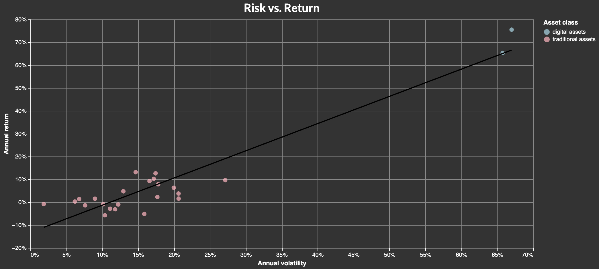
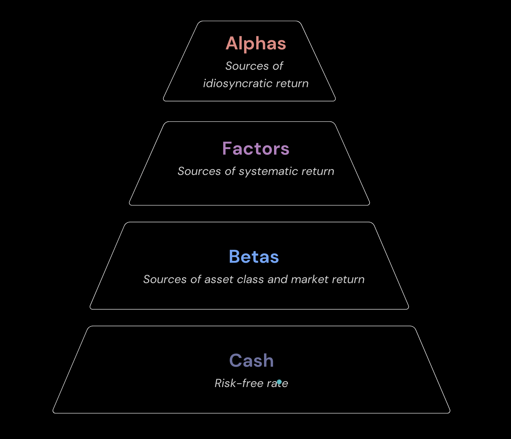
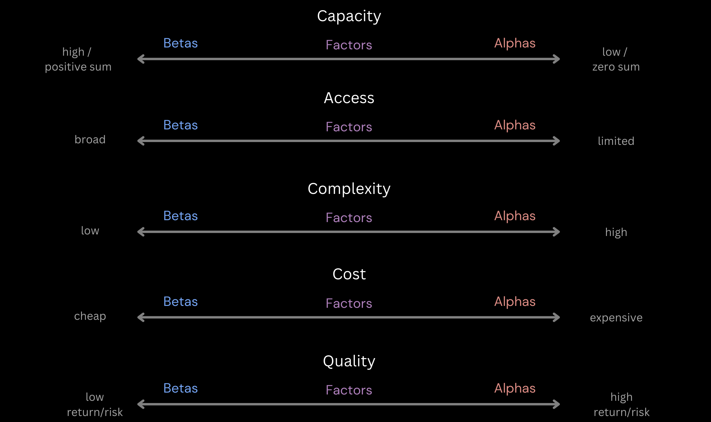
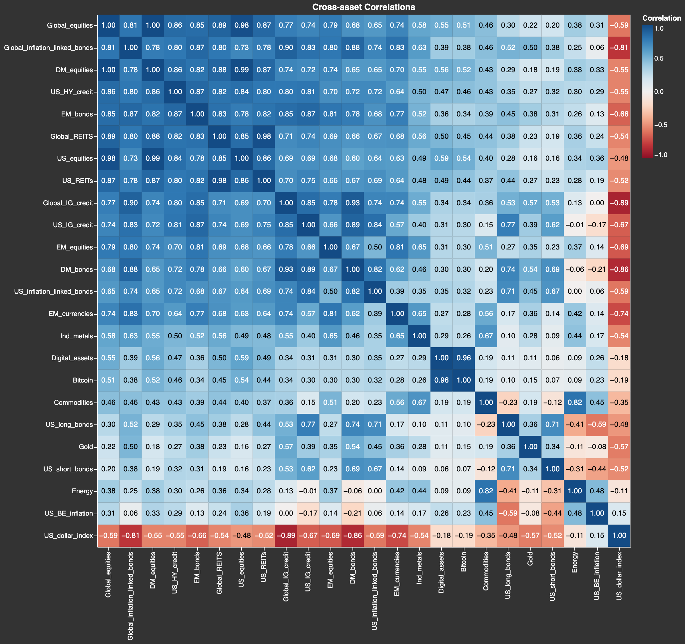
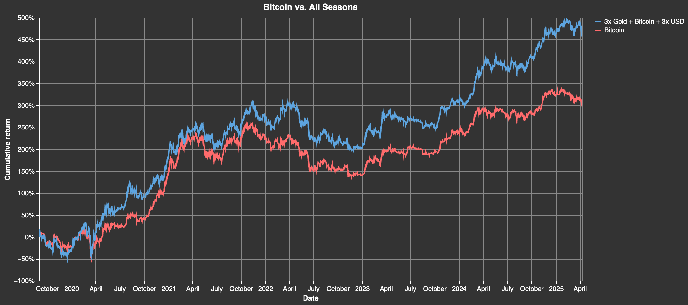

> **“From my earlier failures, I knew that no matter how confident I was in making any one bet I could still be wrong — and that proper diversification was the key to reducing risks without reducing returns. If I could build a portfolio filled with high-quality return streams that were properly diversified — they zigged and zagged in ways that balanced each other out, I could offer clients an overall portfolio return much more consistent and reliable than what they could get elsewhere.” — Ray Dalio**

Portfolio construction is one of the most important yet overlooked aspects of the investment process. It involves combining a set of returns streams  (asset or strategies) to achieve the highest possible return for a given level of risk. Unlike **asset selection** which deals with **what**, or  **market timing** which deals with **when**, **portfolio construction** focuses on **how much**. Modest differences in asset allocation weights in a portfolio holding the same assets can lead to significant differences in performance.

To illustrate this, we will walk through the principles of portfolio construction and show how to follow them to implement a simple portfolio that can outperform bitcoin using a an intuitive asset allocation mix: bitcoin, gold and the U.S. dollar.

## Summary {#72efbdf983c748b2b467ae260a2fa4d6}

- **At the heart of portfolio construction lies the fundamental trade-off between return and risk. The goal for any investors is to create a portfolio with the highest return per unit of risk**.
- **Positive returns can come from distinct sources: cash, betas, factors and alphas. Investors should always start to build their portfolios with easy to access and cheap betas, then layer on factor strategies, and lastly add alpha exposure. A big mistake many investors make is that they follow these steps in reverse**.
- **Portfolio optimization algorithms are used by sophisticated institutional investors to combine return streams in a way to maximize a portfolio’s return for a given level of risk. Not all return sources come with the same risk. Levering exposure to some returns streams and delevering others allows investors to create a more balanced and resilient portfolio. The portfolio's returns are always a function of the level of targeted risk, which should depend on the investor's risk tolerance**.

## The Return vs. Risk Trade-Off {#b5d46a72e8a74772b886b6aec6008ffe}

**At the heart of portfolio construction lies the fundamental trade-off between return and risk**. In order to incentivize investors to hold riskier assets, there must be a positive relationship between risk, commonly defined as annualized standard deviation (or maximum drawdown), and expected return. This helps us explain why assets with higher risk such as equities, private equity and junk bonds generally come with higher returns than lower risk assets such as investment grade bonds, Treasuries, T-bills and cash. This is also a well documented empirical finding which can be observed in the cross-section of asset class returns, shown below.

Over the past five years, digital assets have been the riskiest asset class, with the highest annualized volatility and drawdowns. However, investors have been well compensated for those risks with annual returns also much higher than traditional assets. **The goal of any investors should be to construct a portfolio that achieves the highest return per unit of risk, often measured with risk-adjusted return ratios like Sharpe or Calmar ratio.**

## Sources of Return: the Alpha-Beta Spectrum {#1b946a0cd0c380968070eba94b8b3112}

Most of the world’s top institutional investors understand the importance of combining multiple return streams that have a positive expected return but are diversifying/have low correlations, aka the “Holy Grail of Investing”$^1$. This approach is the foundation for Bridgewater’s All Weather portfolio, which diversifies across asset classes like equities, bonds, commodities, and inflation-linked securities$^2.$ AQR extends this concept through factor investing—targeting distinct return drivers such as value, momentum, carry, and defensive strategies to improve diversification beyond traditional asset classes$^3$. Blackrock also emphasizes diversification as a core tenet of good portfolio construction and central to their line of investment products$^4$.

While there  may be thousands of investment products (e.g. hedge funds, ETFs, index funds,  etc) which package bundles of assets and strategies, their performance can be broken down into 4 distinct return sources: 

Portfolio return = _cash + betas + factors + alphas_

- **Cash**: the return earned by buying and holding the risk-free interest rate, or the yield on short-term government debt (e.g. U.S. T-bills).
- **Betas**: aka traditional betas, risk premia or asset class premia, earn an excess return above the risk-free rate by buying and holding riskier assets, e.g. longer maturity government bonds, corporate bonds, equities, REITs, etc. Betas are often earned by passively investing in a broad asset class, such as equities, bonds, commodities and real estate, aka asset class premia.
- **Factors**: aka smart betas, alternative risk premia/beta, factor premia, or style premia, earn an excess return above the risk-free rate with long-short rules-based strategies which use quantifiable characteristics or “factors” to provide common sources of systematic risk and return.
- **Alphas**: aka idiosyncratic returns, earn an excess return above both the risk-free rate through active investment strategies that exploit inefficiencies, mispricings, or informational advantages in the market, typically requiring deep knowledge, specialized skill, proprietary models, or superior execution.

These return sources are shown below in the Alpha-Beta pyramid. 

What makes these return streams distinct from each other can be better understood by comparing them across key characteristics: capacity, access, complexity, cost and quality, which is summarized below in the **Alpha-Beta continuum**.

- **Betas** have high capacity to absorb huge pools of capital and are positive-sum (all investors can make money with them), are easily accessible (wide range of investment products), simple to implement (e.g. market-cap weighted), are cheap (low management fee), and outperform cash but have low risk-adjusted returns. For example, U.S. Treasuries are some of deepest and most liquid asset markets in the world estimated to be over $30 trillion and investors can use ETFs like TLT to gain exposure to them.
- **Factors** have lower capacity than traditional betas but are also positive-sum (most investors can make money with them), are somewhat less accessible than betas (a more limited range of investment products mostly available to institutional investors), require more sophisticated algorithms and derivatives (futures/swaps) to implement well (e.g. factor construction), are slightly more expensive than betas (higher management fee and/or performance fee), and typically have higher risk-adjusted than betas. For example, Blackrock's equity momentum ETF [MTUM](https://www.ishares.com/us/products/251614/ishares-msci-usa-momentum-factor-etf) which is implemented as a long-only factor strategy accessible to all investors with most long-short momentum strategies offered mostly by hedge funds or investment banks to accredited investors.
- **Alphas** have the lowest capacity and are zero-sum (one side makes money while the other side losses money), are only accessible to accredited and mostly large institutional investors with minimum investment requirements (few investors can make money with them), complex to implement and require high levels of sophistication and skill (idiosyncratic sources of return), are the most expensive (high performance fees, as much as 50% for the best hedge funds), and generally have the highest risk-adjusted returns that are nearly impossible to replicate.

The mistake most unsophisticated investors make is leaving money on the table by not earning the positive-sum returns that can be obtained from betas and factors. They try to play the zero-sum game and trade the markets in the pursuit of alpha. Yet, betas and factors outperform cash over time and are accessible to most investors. Alphas, on the other hand, are not easy to come by, tend to decay when other investors discover and trade them (aka alpha decay), and can always be ‘stacked’ on top of betas and factors, ultimately leading to higher portfolio risk-adjusted returns.

This concept of ‘stacking’ return streams on top of each other as shown in the Alpha-Beta pyramid is not new. It has been used by sophisticated institutional investors for decades, one variant of which is known as ‘portable alpha’ [[5]](https://www.amazon.com/Portable-Alpha-Theory-Practice-Investors/dp/0470118083)[[6]](https://www.panagora.com/wp-content/uploads/JPM-Portable-Alpha.pdf)[[7]](https://www.man.com/insights/portable-alpha-solving-magnificent-problem). Lastly, the separation of alphas (active strategies) from betas (passive strategies) is not just an important conceptual framework for building better performing portfolios, it can also have practical implications for tax benefits [[8]](https://papers.ssrn.com/sol3/papers.cfm?abstract_id=3178273).

## Portfolio Optimization: Combining Return Streams {#ac853c3a97a2487dafa1ae323eac5089}

Once a set of return streams has been identified, portfolio optimization techniques help managers determine the right capital allocation to each. This is the question of how to size positions in a portfolio, or **how much**. **Sophisticated institutional investors combine optimization algorithms like mean-variance optimization, risk parity, risk targeting, maximum diversification and others to size positions such that risk-adjusted returns are maximized** [[9]](https://www.amazon.com/Quantitative-Portfolio-Optimization-Techniques-Application/dp/1394281315/142-3097046-3062465?pd_rd_w=boYxc&content-id=amzn1.sym.46e2be74-be72-4d3f-86e1-1de279690c4e&pf_rd_p=46e2be74-be72-4d3f-86e1-1de279690c4e&pf_rd_r=QT4Z2FDFDTVGA9Q3QMDP&pd_rd_wg=5LNWG&pd_rd_r=5d26063e-8ee6-4e6c-b557-b0f6acb284d5&pd_rd_i=1394281315&psc=1).

Leverage can also be a powerful tool in portfolio construction. When used properly, it allows investors to scale up exposure to lower volatility and uncorrelated return streams without increasing portfolio risk or lowering returns. The key is ensuring leverage is accessible at a low cost and used in a way that increases, rather than lowers portfolio risk-adjusted returns.

Lastly, before constructing a portfolio, it is crucial to know an investor’s risk tolerance. This involves understanding capital constraints, margin requirements, investment time horizon, and investor psychology. Many investors perceive their risk tolerance to be higher than it actually is. This often leads to "forced selling" at the worst possible time during a large drawdown, which has disastrous implications for wealth compounding in the long run. Large drawdowns can destroy the prospects of a good strategy given the asymmetry in compounding returns, e.g. an investor needs a 100% gain to recover from only a 50% drawdown. Historical simulation and portfolio optimization can help provide estimates for portfolio risk and keep volatility/drawdowns within tolerable levels.

## The Diversification Problem: Crypto Provides Few Opportunities for Diversification {#869430a1f9214cbab47f00b8cc910807}

One of the biggest challenges for crypto investors is the lack of potential diversification offered within the asset class. This means that a large basket/portfolio of cryptoassets is much more concentrated in risk than the equivalent in other asset classes. Said differently, the opportunity for an investor to diversify well within crypto assets is severely constrained.

One way to tackle this lack of diversification is to broaden the asset universe to include traditional assets. Correlations to other asset classes like commodities and bonds tend to be much lower which can improve risk-adjusted returns. This diversification benefit has been one of the main drivers behind rising allocations to crypto as an asset class [[10]](https://www.blackrock.com/us/individual/literature/whitepaper/bitcoin-a-unique-diversifier.pdf).

## Return Stacking: From Stacking Sats to Stacking Return Streams {#4b9ad5d1662f47e1beb99265652b02a5}

To illustrate how to use these portfolio construction principles, we start with a bitcoin position and add to it two positive and uncorrelated return streams from different asset classes: US Treasuries futures (bonds) and gold futures (commodities). Both assets provide access to cost-effective leverage through futures which allows us to balance risks by leveraging up bond and gold returns and in the process maximizing risk-adjusted returns. Putting together a multi-asset portfolio also ensures that correlations across return streams will be lower than a portfolio of cryptoassets which have high correlations, but this same principle can be applied with long/short crypto portfolios as well (aka factors or alphas). For more on this, see our factor investing primer.

To illustrate the power of portfolio construction, we compare the historical performance of our simple 3 asset class portfolio to buying and holding bitcoin over the same period.

This illustrative example shows how performance can be improved without any skill in asset selection or market timing, but rather a the simple application of powerful portfolio construction principles.

## References {#7c97f22fd2fb4b74aafbaf0d4e72acaf}

[1] Investopedia, _Ray Dalio Breaks Down His "Holy Grail"_, YouTube

[2] Bridgewater (2012). _The All Weather Story - How Bridgewater Associates created the All Weather investment strategy, the foundation of the ‘risk parity’ movement_, Bridgewater Associates, LP. Jan. 

[3] AQR (2021). _Time to Diversify – But into What? The case for diversifying out of equities, and the role of liquid alternatives_, AQR. Q4. 

[4] Blackrock. _Diversifying Investments_, Blakcrock, Portfolio Construction, Module 5.

[5] Sabrina Callin (2008). _Portable Alpha Theory and Practice: What Investors Really Need to Know_, Willey. April 4.

[6] Edward Kung and Larry Pohlman (2004). _Portable Alpha - Philosophy, process, and performance_, Journal of Portfolio Management, Volume 30, number 3. Spring. 

[7] Graham Robertson, Edward Cole, Eva Sanchez Martin, Jonathan Smith, Harry Moore and Otto van Hemert (2025). _Portable Alpha: Solving the Magnificent Problem_, Man AHL. Jan. 

[8] Joseph Liberman, Clemens Sialm, Nathan Sosner and Lixin Wang (2020). _The Tax Benefits of Separating Alpha from Beta_, Financial Analysts Journal, Volume 76 Number 1. Jan 30. 

[9] Miquel Noguer Alonso, Julian Antolin Camarena and Alberto Bueno Guerrero (2025). _Quantitative Portfolio Optimization: Advanced Techniques and Applications_, Wiley Finance, 1st Edition. Jan 25.

[10] Samara Cohen, Robert Mitchnick, Russel Brownback (2024). _Bitcoin: A Unique Diversifier_. Blackrock. 

