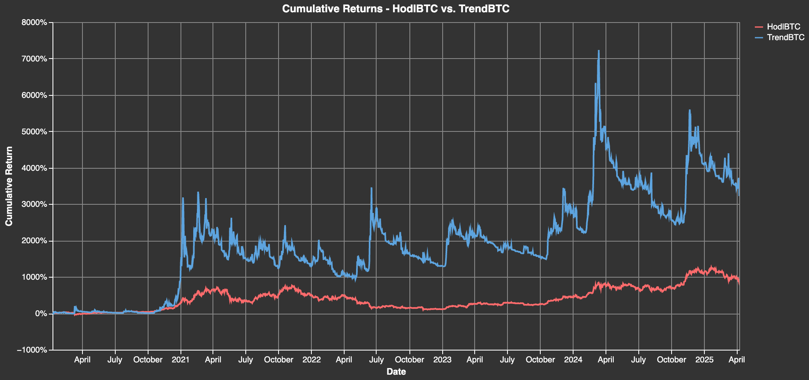
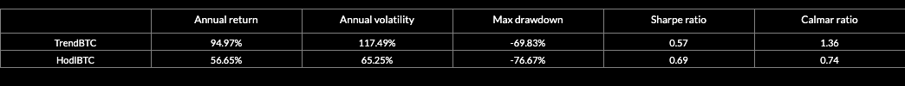
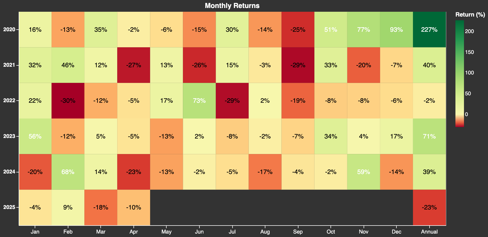
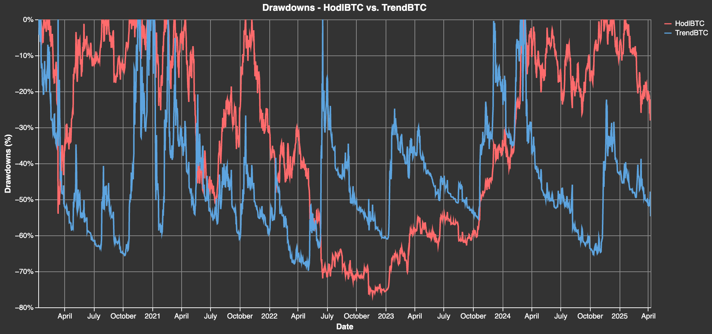
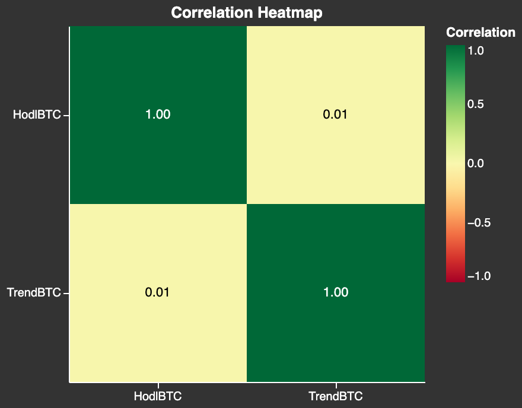
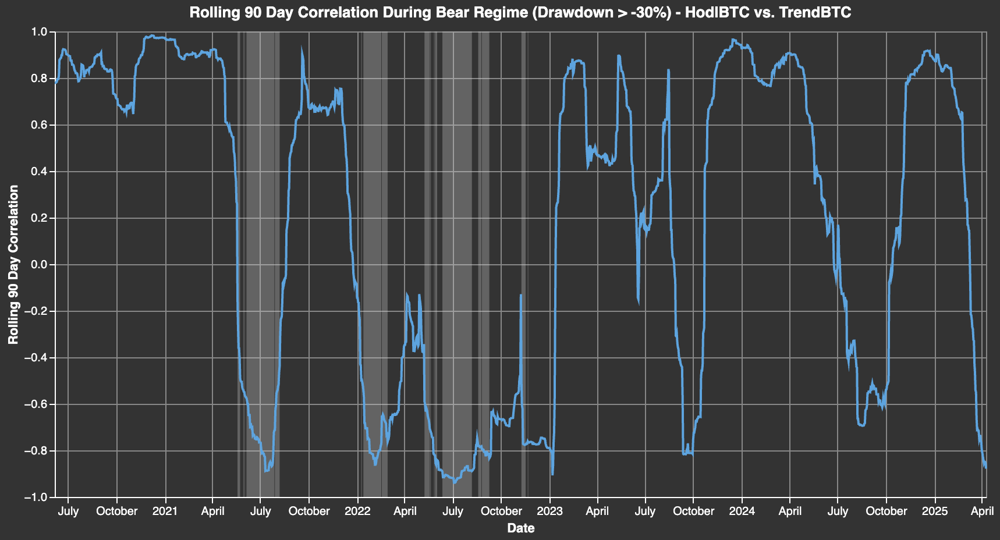

# Description {#1d146a0cd0c38035a6a5cccb895e8d26}

Trend strategies exploit the persistence of trends in asset prices by going long assets whose prices have been rising and short assets whose prices have been falling.

Trend following has several advantages that make it an attractive strategy for investors:

- _Positive and high risk-adjusted returns._
- _Low correlations to long market exposure, eg. HodlBTC._
- _Lower volatility/drawdowns._
- _Positive returns during bitcoin drawdowns/bear markets._

# Economic Rationale {#ff7f319adefd4845aae14a3d2f313761}

Price trends can persist for behavioral as well as risk-based reasons. The effectiveness of the momentum effect is well documented in quantitative finance. Behavioral explanations suggest that investors tend to under-react to new information in the short-term and subsequently chase returns leading to a "bandwagon" or herding effect. Alternatively, risk-based explanations argue that the momentum premium can be explained by macroeconomic risks like liquidity and other macro factors. 

# TrendBTC {#15ef80990b7040a09ef2afe539792f69}

**TrendBTC seeks to produce similar returns as a buy-and-hold Bitcoin strategy (HodlBTC) with much lower risk.**

## Methodology {#aae5935e9e244f0eab543c317de421dc}

- **Asset universe**: Bitcoin (BTC)
- **Factor construction**: this involves transforming price data into trend factor scores that quantify the strength and direction of an asset's price momentum relative to its past history and capture the tendency of assets that have performed well (or poorly) in the past to continue performing well (or poorly) in the future. It is computed using smoothing/filtering techniques by taking the difference between the current price and the price of the asset n periods ago, where n is the lookback window.
- **Signal generation**: once factor scores are computed, they are converted into signals (forecasts) with values between -1 and 1 using some form of mathematical transformation (learner or function).
- **Sizing**: positions are sized in order to achieve a desired volatility target. A volatility scaling factor is computed as the volatility target divided by the realized volatility over the past 3 months. The signal is adjusted by the volatility scaling factor.
- **Rebalancing**: daily.
- **Leverage**: 2x.

## Market Regimes {#6b6c8241fc2e45b583307fe71cbd670a}

Trend strategies work well in trending markets, and poorly in directionless markets. Trending markets can often coincide with periods of high volatility and stress in financial markets, also known as crisis alpha. Hence, they can be good diversifiers during bad times for most assets (see diversification below).

# Performance {#1d146a0cd0c3803a83acd1338d7f891b}

## Returns {#1d146a0cd0c3808ab7f6e645cbf07ee6}

## Drawdowns {#1d146a0cd0c3809b9278c73cb9a70bac}

## Diversification {#1d146a0cd0c380aba38aead7d9643005}

# Literature {#36a7bc568eab4dfbb7be32383f72a678}

- [Rozario-Holt-West-Ng 2020- “A Decade of Evidence of Trend Following Investing in Cryptocurrencies”](https://arxiv.org/abs/2009.12155)
- [Tzouvanas-Kizys 2020 - “Momentum trading in cryptocurrencies: Short-term returns and diversification benefits”](https://www.sciencedirect.com/science/article/abs/pii/S0165176519303647)
- [Liu-Tsyvinsky-Wu 2019 - “Common Risk Factors in Cryptocurrency”](https://papers.ssrn.com/sol3/papers.cfm?abstract_id=3394671)
- [Kakushadze 2018 - “Cryptoasset Factor Models”](https://arxiv.org/abs/1811.07860)
- [Hubrich 2017 - “Know when to hodl them, know when to
fodl them”: An Investigation of Factor Based
Investing in the Cryptocurrency Space](https://papers.ssrn.com/sol3/papers.cfm?abstract_id=3055498)
- [Asness-Moskowitz-Pedersen 2012 - “Value and Momentum Everywhere”](https://papers.ssrn.com/sol3/papers.cfm?abstract_id=2174501)
- [Moskowitz-Hua Ooi-Pedersen 2010 - “Time Series Momentum”](https://papers.ssrn.com/sol3/papers.cfm?abstract_id=2089463)
