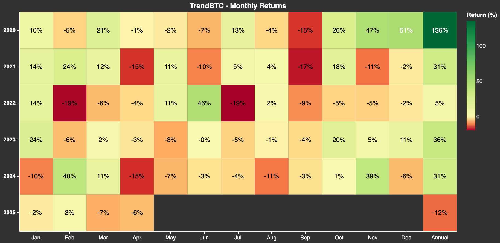

# TrendBTC {#1d146a0cd0c38035a6a5cccb895e8d26}

**TrendBTC seeks to produce higher returns than a buy-and-hold bitcoin strategy (HODL) with the same risk.**

## Description

Trend following strategies exploit the persistence of trends in asset prices by going long assets whose prices have been rising and short assets whose prices have been falling.

Trend following has several advantages that make it an attractive strategy for investors:

- _Positive and high risk-adjusted returns._
- _Low correlations to long market exposure._
- _Lower volatility/drawdowns._
- _Positive returns during crypto bear markets (winter)._

### Economic Rationale

Price trends can persist for behavioral as well as risk-based reasons. The effectiveness of the momentum effect is well documented in quantitative finance. Behavioral explanations suggest that investors tend to under-react to new information in the short-term and subsequently chase returns leading to a "bandwagon" or herding effect. Alternatively, risk-based explanations argue that the momentum premium can be explained by macroeconomic risks like liquidity and other macro factors. 

### Methodology {#aae5935e9e244f0eab543c317de421dc}

- **Asset universe**: Bitcoin (BTC)
- **Factor construction**: this involves transforming price data into trend factor scores that quantify the strength and direction of an asset's price momentum relative to its past history. The trend factor captures the tendency of assets that have performed well (or poorly) in the past to continue performing well (or poorly) in the future. It is computed using smoothing/filtering techniques by taking the difference between the current price and the price of the asset n periods ago, where n is the lookback window.
- **Signal generation**: once trend factor scores are computed, they are converted into signals (forecasts) with values between -1 and 1 using a mathematical transformation (learner and/or function).
- **Sizing**: positions are sized in order to achieve a desired volatility target. A volatility scaling factor is computed as the volatility target divided by the realized volatility over the past 3 months. The signal is adjusted by the volatility scaling factor.
- **Rebalancing**: daily.
- **Leverage**: customizable. Leverage can be increased to enhance returns, or decreased to reduce risk in-line with investor risk preferences.

### Market Regimes

Trend strategies work well in trending markets, and poorly in directionless markets. Trending markets can often coincide with periods of high volatility and stress in financial markets, also known as crisis alpha. Hence, they can be good diversifiers during bad times for most assets (see diversification below).

## Performance

The historical performance shown represents the average of many simulations across a range of trend-following algorithms and parameters, rather than a single backtest. It provides an unbiased estimate of future performance, avoiding the inflated expectations that often come from overly optimized backtest results. All returns are risk-adjusted to match the asset’s historical volatility.

### Returns {#1d146a0cd0c3808ab7f6e645cbf07ee6}

TrendBTC can be added to a passive long BTC exposure to enhance risk-adjusted returns. 

### Drawdowns {#1d146a0cd0c3809b9278c73cb9a70bac}

TrendBTC can reduce drawdowns by up to half of those of BTC.

### Diversification {#1d146a0cd0c380aba38aead7d9643005}

TrendBTC has very low correlation to BTC and broad crypto asset exposure, serving as a good portfolio diversifier especially during bear markets.

## More Information

### Strategist

Internal team

### Trend Following

To learn more about trend following, see Trend Following (coming soon).

### Trend Vault

To deposit in this strategy, go to our vault.

### Tokenized Funds

To learn more about tokenized funds, read [Tokenized Funds - The Next Evolution of Fund Management](/tokenized-funds).

